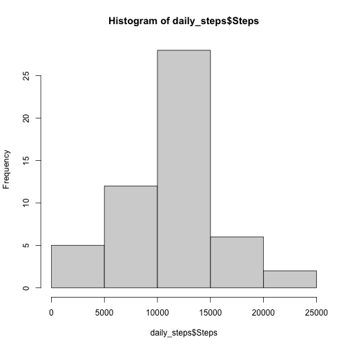
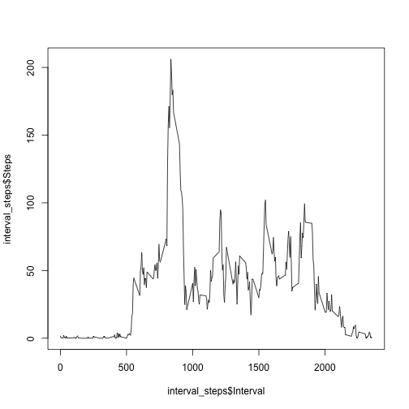
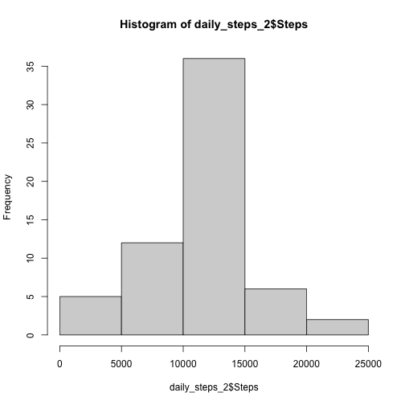
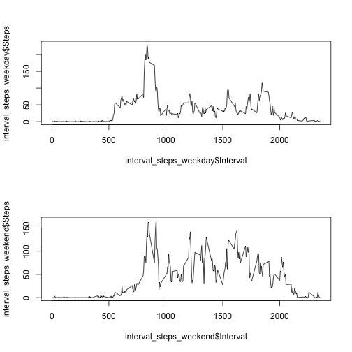

## Loading and preprocessing the data

```r
activity <- read.csv('./activity.csv')
```

## What is mean total number of steps taken per day?

```r
daily_steps <- setNames(aggregate(activity$steps, by = list(activity$date), sum), c("Date", "Steps"))
hist(daily_steps$Steps)
```



```r
mean_step <- mean(daily_steps$Steps, na.rm = TRUE)
median_step <- median(daily_steps$Steps, na.rm = TRUE)
```
The mean total number of steps taken per day is 10766 and the median is 10765.

## What is the average daily activity pattern?

```r
interval_steps <- setNames(aggregate(activity$steps, by = list(activity$interval), mean, na.rm = TRUE), c("Interval", "Steps"))
plot(interval_steps$Interval, interval_steps$Steps, type = 'l')
```



```r
max_step <- interval_steps[which.max(interval_steps$Steps), ]
max_interval <- max_step$Interval
```
The interval with max average daily step is interval 835.

## Imputing missing values

```r
n_missing <- sapply(activity, function(x) sum(is.na(x)))
activity_2 <- activity
for (i in 1:nrow(activity)) {
    if (is.na(activity[i, 1])) {
        activity_2[i, 1] = interval_steps$Steps[interval_steps$Interval == activity$interval[i]]
    }
}

daily_steps_2 <- setNames(aggregate(activity_2$steps, by = list(activity_2$date), sum), c("Date", "Steps"))
hist(daily_steps_2$Steps)
```



```r
mean_step_2 <- mean(daily_steps_2$Steps, na.rm = TRUE)
median_step_2 <- median(daily_steps_2$Steps, na.rm = TRUE)
```
The mean does not change when applying 5-min average to miising values, the median changes slightly.

## Are there differences in activity patterns between weekdays and weekends?


```r
activity_2$day <- weekdays(as.Date(activity_2$date))

activity_2 <- transform(activity_2, weekend = ifelse(day == "Sunday" | day == "Saturday", TRUE, FALSE))

activity_weekday <- activity_2[activity_2$weekend == FALSE, ]
activity_weekend <- activity_2[activity_2$weekend == TRUE, ]
interval_steps_weekday <- setNames(aggregate(activity_weekday$steps, by = list(activity_weekday$interval), mean, na.rm = TRUE), c("Interval", "Steps"))
interval_steps_weekend <- setNames(aggregate(activity_weekend$steps, by = list(activity_weekend$interval), mean, na.rm = TRUE), c("Interval", "Steps"))
par(mfrow = c(2, 1))
plot(interval_steps_weekday$Interval, interval_steps_weekday$Steps, type = 'l')
plot(interval_steps_weekend$Interval, interval_steps_weekend$Steps, type = 'l')
```


